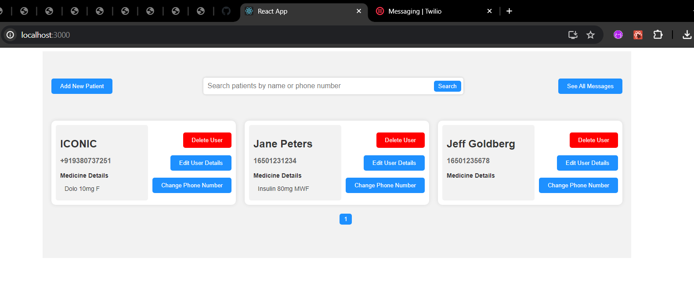

# SMS-based Medicine Reminder with Twilio

Create software for a hospital system to remind patients via SMS when they need to take certain medicines. Imagine that your data is structured in a CSV in the following fashion:

Jane Peters, 16501231234, Insulin, 80mg, MWF

Jeff Goldberg, 16501235678, Amoxicillin, 40mg, TTh

An example CSV is provided in the project Github repository. The first entry can be read as "Jane Peters, whose phone number is 16501231234, needs to take a dose of 80mg of Insulin on each of Monday, Wednesday, and Friday every week." The second entry can similarly be read as "Jeff Goldberg, whose phone number is 16501235678, needs to take a 40mg dose of Amoxicillin on each of Tuesday and Thursday every week."

Use these entries to send SMS messages to each individual reminding them to take the prescribed amount of medicine each day they have to take it. For example, Jane should receive a SMS message on Wednesday with a message like: "Remember to take 80mg of Insulin today!"

You should:
1. Sign up for a Twilio account and create a new project. Use test credentials so your account is not charged.
2. Set up a local development environment. We recommend using the Twilio Python library but you may work in whatever language you feel most comfortable with.
3. Write a script to send reminders via SMS using Twilio's Programmable SMS API. The script should query the database for when patients need to take certain medicines and send a reminder message to the customer's phone number using the Twilio API. The message should include the medicine name and dosage. 

Optional, but suggested:

4. Translate the CSV into a more functional database using PostgreSQL, MongoDB, etc. 

5. Create a web portal where hospital staff can access the database, add patients, edit medicine and dosage amounts, etc. 

6. Set up a webhook to handle customer responses. When a customer replies to the reminder message, the webhook should update the database with the customer's response. Examples of customer responses can be "Yes" or "My prescription is out."

7. Add the ability for hospital staff to attribute two different medicines to a patient. If the patient needs to take two different medicines on the same day, they should only receive one message.

8. Add the ability for hospital staff to attribute up to a dozen different medicines to a patient.

9. Any other features you think may be useful. Explicitly enumerate these at the top of our ReadMe along with brief explanations of why you implemented them. 

# screen shots





# Tech Stack 

## Front End

### <li>React</li>

## Back End

### <li>NodeJS</li>
### <li>Express</li>

## Database

### <li>MongoDB</li>

## Notification Service

### <li>Twilio</li>

# Installation 

Open a Terminal to Install and Run FrontEnd

```bash
cd dashboard
npm i
npm start
```

This will open a new browser window with react running on it.

Open A new Terminal to run backend

```bash
cd Backend
npm i
npm start
```

Also don't forget to add ```.env``` file i=on ```/Backend/``` . It will look like 

```js
MONGOURI=
PORT=
TWILIO_ACCOUNT_SID=
TWILIO_AUTH_TOKEN=
TWILIO_PHONE_NUMBER=
MONGO_URL=
APP_SECRET=
TWILIO_MESSAGING_SERVICE_SID=
```


# Features Fulfilled

- &#9745; Sign up for a Twilio account and create a new project.

- &#9745; Set up a local development environment. Used NodeJS

- &#9745; Write a script to send reminders via SMS using Twilio's Programmable SMS API. The script should query the database for when patients need to take certain medicines and send a reminder message to the customer's phone number using the Twilio API. The message should include the medicine name and dosage.

- &#9745; Translate the CSV into a more functional database using MongoDB. 

- &#9745; Create a web portal where hospital staff can access the database, add patients, edit medicine and dosage amounts.

- &#9745; Set up a webhook to handle customer responses. When a customer replies to the reminder message, the webhook should update the database with the customer's response. Examples of customer responses can be "Yes" or "My prescription is out."

- &#9745; Add the ability for hospital staff to attribute two different medicines to a patient. If the patient needs to take two different medicines on the same day, they should only receive one message.

- &#9745; Add the ability for hospital staff to attribute up to a dozen different medicines to a patient.

# Future Features and Implementations

- &#9744;  Add Authentication And Authorization 
- &#9744;  Host The WebApp
- &#9744;  Implement ChatBot
